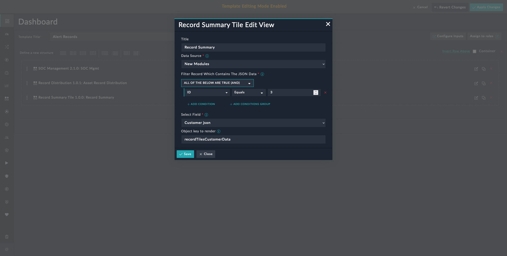

| [Home](../README.md) |
|----------------------|

# Usage
To use this widget users needs to provide a JSON in a certain format for the widget to render data.

This JSON data must be in a module's record that has a field of type JSON.

<table>
    <td><strong>IMPORTANT</strong></td>
    <td>The <code>JSON</code> data to be rendered must have <strong><em>at least one</em></strong> of the following:
        <ul>
            <li><code>data</code> key</li>
            <li><code>title</code> and <code>value</code> keys</li>
        </ul>
    </td>
</table>

Following are two acceptable JSON formats:

<table>
    <thead>
        <th>With <code>data</code> Key</th>
        <th>Without <code>data</code> Key</th>
    </thead>
    <tr>
        <td>
<pre>"recordTilesCustomerData": {
                "data": {
                "Gold": 4000,
                "Diamond": 5000,
                "Platinum": 3000
                },
                "title": "Total Customers",
                "value": "12,000"
            }</pre>
        </td>
        <td>
            <pre>"recordTilesCustomerData": {
    "title": "Total Customers",
    "value": "12,000"
            }</pre>
        </td>
    </tr>
</table>

## Record Summary Tile

1. Edit a *Dashboard*'s view template and select **Add Widget** button.

2. Select **Record Summary Tile** from the list to bring up the **Record Summary Tile** widget's edit view.

3. Specify the title of the visual depiction of each record node in the group in the **Title** field.

    

4. Select the module, whose records are to be displayed, in the **Select Data Source** field. The drop-down lists only those modules that support JSON data fields. For details on editing and creating modules, refer to the *Module Editor* section of the FortiSOAR *Administration Guide*, [here](https://docs.fortinet.com/document/fortisoar/7.4.1/administration-guide/97786/application-editor#Module_Editor).

5. Define the filter criteria using which to filter the data to be rendered by this widget.

    <table>
        <thead>
            <th>Example</th>
        </thead>
        <tbody>
            <td>Filters can be applied for tasks like displaying the widget with only those asset records that meet the following criteria:
                <ul>
                    <li>IDs are not <code>null</code></li>
                    <li>State is <em>Active</em></li>
                </ul>
            </td>
        </tbody>
    </table>

6. Select the field, whose data is to be displayed, in the **Select Field** field. The drop-down lists fields of type `JSON`. For details on editing and creating fields, refer to the *Module Editor* section of the FortiSOAR *Administration Guide*, [here](https://docs.fortinet.com/document/fortisoar/7.4.1/administration-guide/97786/application-editor#Module_Editor).

7. Specify the JSON `key` whose `value` is to be rendered in the **Object key to render** field.

<table>
    <thead>
        <th>Example</th>
    </thead>
    <tbody>
        <td>Consider the following JSON data in one of the record's JSON field:
            <pre>"recordTilesCustomerData": {
                "data": {
                "Gold": 4000,
                "Diamond": 5000,
                "Platinum": 3000
                },
                "title": "Total Customers",
                "value": "12,000"
            }</pre>
            
The following screenshot shows the Record Summary Tile in action with this JSON data.

            

            
Consider the following JSON data in one of the record's JSON field:

            <pre>"recordTilesCustomerData": {
                "title": "Total Customers",
                "value": "12,000"
            }</pre>
            
The following screenshot shows the Record Summary Tile in action with this JSON data.

            

        </td>
    </tbody>
</table>

| [Installation](./setup.md#installation) | [Configuration](./setup.md#configuration) |
|-----------------------------------------|-------------------------------------------|